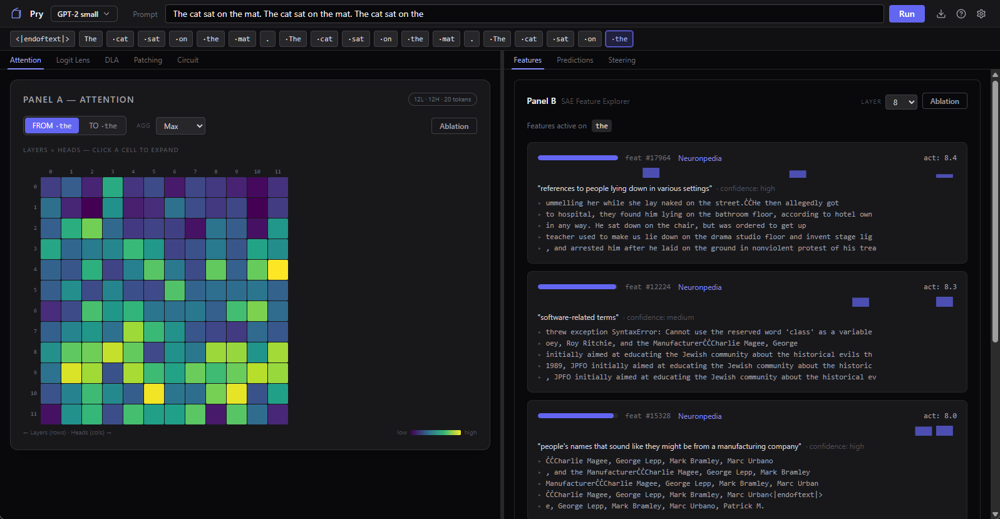

# Pry

Pry open the black box. See what a language model is actually doing when it predicts text, without writing a single line of code or needing a background in machine learning.

Pry runs a small transformer locally on your machine, then gives you tools to look inside it. Every tool explains what you're seeing in plain language, with a built-in tutorial that walks you through the concepts step by step. If you're curious about how AI models work under the hood but don't want to set up a Python notebook to find out, this is for you.



## What You Can Do

- **See what the model predicts** -- ranked list of the model's top guesses for the next word, with confidence scores
- **Watch where it pays attention** -- heatmaps showing which earlier words the model looked at when making each prediction
- **Explore internal concepts** -- the model has thousands of internal "features" (things like "past-tense verb" or "professional role"). Pry shows you which ones fired and how strongly
- **See the model change its mind** -- the logit lens shows what the model would predict at each layer, so you can watch it refine its answer from confused to confident
- **Find out why it predicted that** -- the DLA chart breaks down which specific parts of the model pushed toward or against the predicted word
- **Poke it and see what happens** -- steer a feature up or down and watch the output change. Zero out an attention head and see if the prediction breaks. These are one-click experiments, not code.
- **Find the wiring** -- activation patching swaps pieces between two prompts to find which parts matter. Circuit view draws the connections as a graph.
- **Learn as you go** -- a guided tutorial walks you through two demo prompts, explaining every panel. Contextual tooltips appear the first time you encounter each tool. Everything is written for someone who's curious, not someone who already knows.

## Supported Models

- GPT-2 Small
- Pythia-70M

Gemma-2B and Gemma-9B support is planned.

## System Requirements

- Windows 10 or later
- NVIDIA GPU with 4+ GB VRAM recommended
- 8+ GB RAM
- ~2 GB disk for model runtime (auto-downloaded on first launch)

## Install

Download the latest `Pry_x.x.x_x64-setup.exe` from [Releases](https://github.com/beargleindustries/pry/releases), run the installer, and launch Pry from the Start Menu.

First launch downloads the Python runtime and model weights automatically. No terminal required.

## Build from Source

### Prerequisites

- [Rust](https://rustup.rs/) (stable toolchain)
- [Node.js](https://nodejs.org/) 20+
- Python 3.11 or 3.12
- CUDA toolkit (matching your GPU driver)
- [uv](https://docs.astral.sh/uv/) (Python package manager)

### Steps

```bash
git clone https://github.com/beargleindustries/pry.git
cd pry

# Install frontend dependencies (beforeBuildCommand in tauri.conf.json
# runs from the ui/ directory, so this must be done first if building
# without cargo tauri dev)
cd ui && npm install && cd ..

# Run in dev mode (handles frontend + sidecar automatically)
cargo tauri dev
```

**Note:** The `pry-cli` binary in `src-tauri/src/cli.rs` is a dev/debug tool for running the sidecar standalone. It is not required for normal use.

## Built With

- [Tauri 2](https://v2.tauri.app/) -- desktop shell
- [SvelteKit](https://kit.svelte.dev/) -- frontend
- [TransformerLens](https://github.com/TransformerLensOrg/TransformerLens) -- model hooks and interpretability
- [SAELens](https://github.com/jbloomAus/SAELens) -- sparse autoencoder features
- [PyTorch](https://pytorch.org/) -- tensor compute
- [Tailwind CSS](https://tailwindcss.com/) -- styling

## License

MIT. See [LICENSE](LICENSE).

## Credits

Built by Brad at [Beargle Industries](https://beargle.com).
